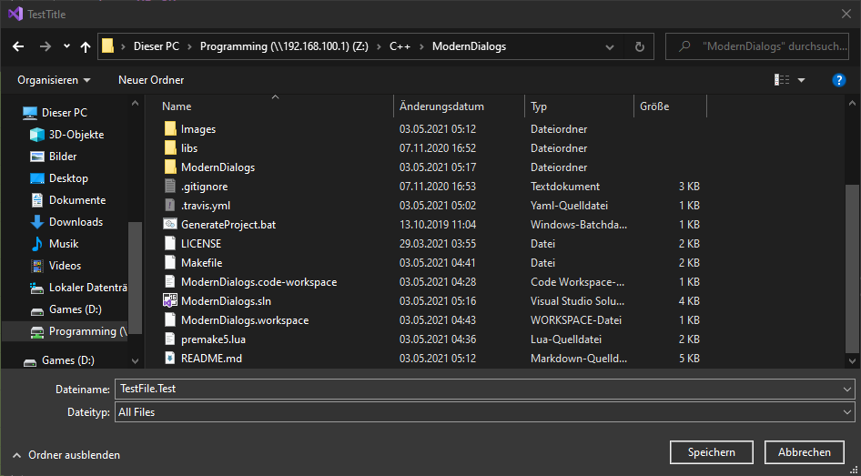
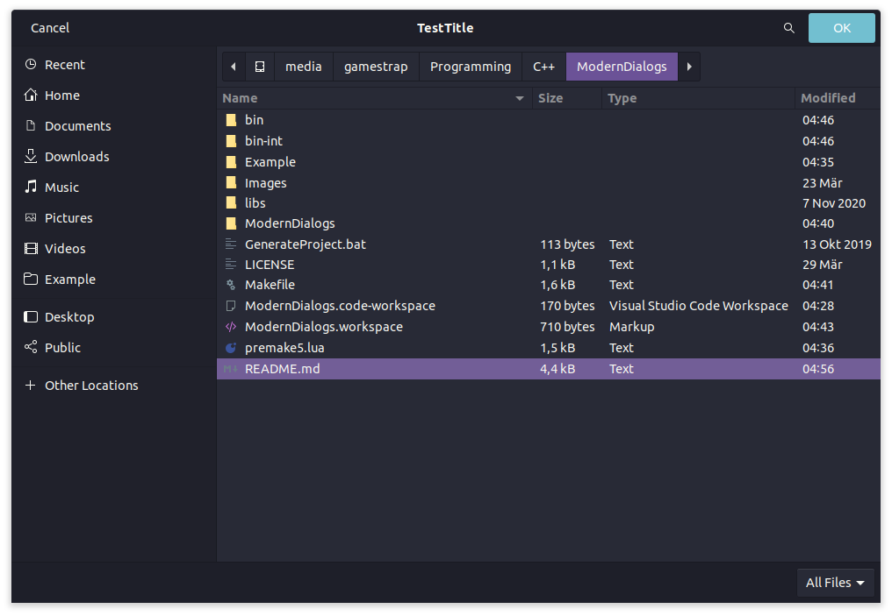
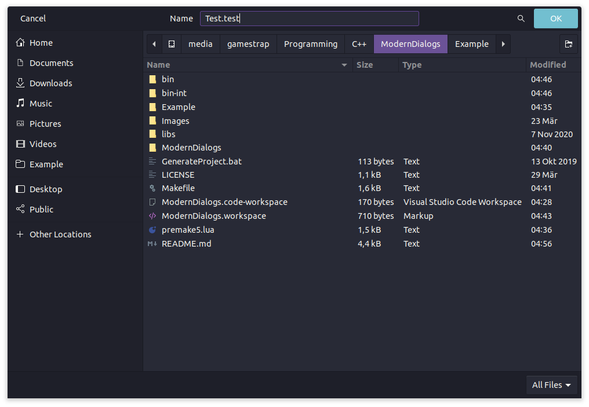
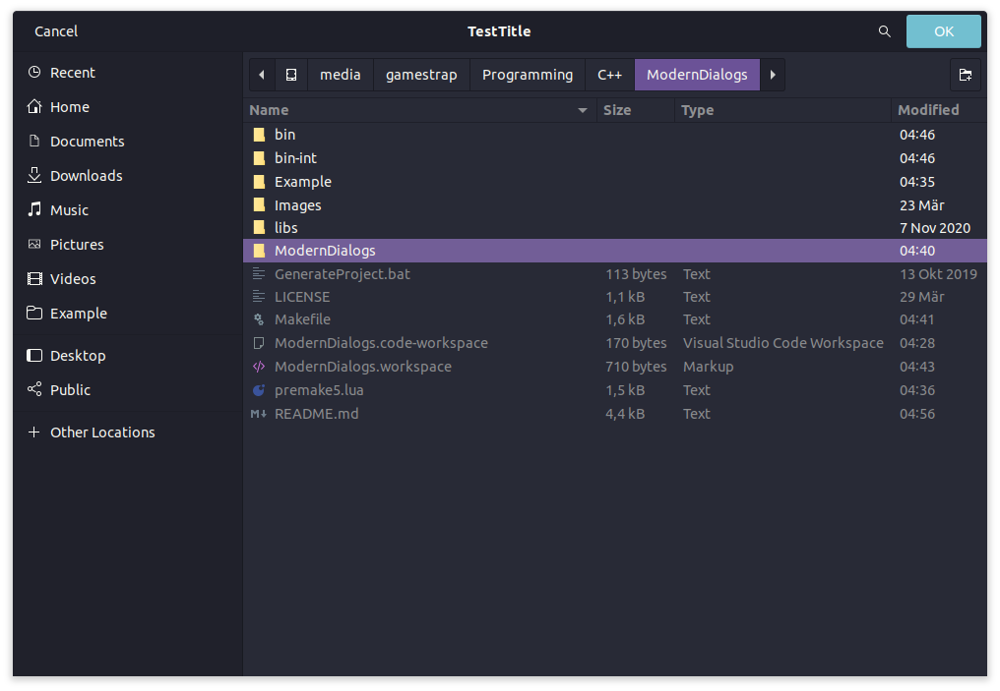

# ModernDialogs

ModernDialogs (Cross-platform Linux, Windows C++17)  
OpenFileDialog, SaveFileDialog, SelectFolderDialog & MessageBox  
Supports ASCII & UTF-8

## Information

### Windows

On Windows ModernDialogs uses the WinAPI for every dialog.

### Linux

On Linux the dialogs are created by using one of the following packages if installed:

- KDialog
- Zenity
- MateDialog
- Shellementary
- Qarma
- Yad
- TKinter3

If none of these packages are installed then you will get an empty string, a vector of empty strings, or a `MD::Selection::Error` as the return value depending on the called function.

## Screenshots

Windows 10 20H2:  

OpenFile:
 

 
SaveFile:
 

 
SelectFolder:
 

 
MessageBox:
 

Ubuntu 20.10 X11 Gnome 3:  

OpenFile:
 

 
SaveFile:
 

 
SelectFolder:
 

 
MessageBox:
 

## Setup

First clone the repository with `git clone https://github.com/GamesTrap/ModernDialogs`.

Then, execute one of the generator scripts in the GeneratorScripts folder.

## License

MIT License

Copyright (c) 2020-2022 Jan "GamesTrap" Schürkamp

Permission is hereby granted, free of charge, to any person obtaining a copy
of this software and associated documentation files (the "Software"), to deal
in the Software without restriction, including without limitation the rights
to use, copy, modify, merge, publish, distribute, sublicense, and/or sell
copies of the Software, and to permit persons to whom the Software is
furnished to do so, subject to the following conditions:

The above copyright notice and this permission notice shall be included in all
copies or substantial portions of the Software.

THE SOFTWARE IS PROVIDED "AS IS", WITHOUT WARRANTY OF ANY KIND, EXPRESS OR
IMPLIED, INCLUDING BUT NOT LIMITED TO THE WARRANTIES OF MERCHANTABILITY,
FITNESS FOR A PARTICULAR PURPOSE AND NONINFRINGEMENT. IN NO EVENT SHALL THE
AUTHORS OR COPYRIGHT HOLDERS BE LIABLE FOR ANY CLAIM, DAMAGES OR OTHER
LIABILITY, WHETHER IN AN ACTION OF CONTRACT, TORT OR OTHERWISE, ARISING FROM,
OUT OF OR IN CONNECTION WITH THE SOFTWARE OR THE USE OR OTHER DEALINGS IN THE
SOFTWARE.
